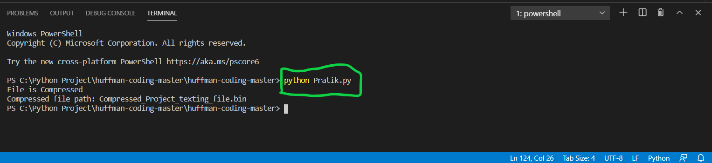
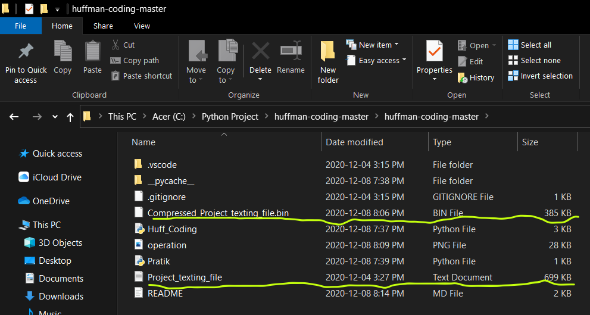

### Project Title
Implementation of Huffman Coding using Pyhton for Text file

### Explanation
The main usage of Huffman Coding is to change the size of an file (Audio, Video and Text) without making any changes to its data.
As it is clear, we have use heap data structure which mainly represent priority queue. In Python, it is avalaible using heapq module. The property of the data structure is such that each time any smallest of heap element is popped it gets detected in Python and its structure is also maintained. There are various functions in the heapq library in which heappop unciton is used in this application. Heappop means when a smallest element from heap is removed or return, the order is adjusted, so as heap structure is maintained.  
Now the second module we have used in this project is os module. The os module provides functions for interacting with the operating system. This module provides a portable way of using operating system dependent functionality

### Project Layout
This project is completed using Pyhton 3.9.0 64-bit extension in Visual Studio Code

#### Testing / Running the program

1. Save / Clone the above repository
2. Now the repository consists of a sample file named as "Project_texting_file" which is of size 699KB.
3. Run the python code `Pratik.py` to compress the given text file. For eg. open terminal and run `python Pratik.py`

4. As the above pictorial clearly shows that the text file is successfully compressed and also it is nearly half the size of the original one. The resulted file will be is the same location named as "Compressed_Project_texting_file.bin".

To run the code for compression of any other text file, edit the `path` variable in the `Pratik.py` file.
